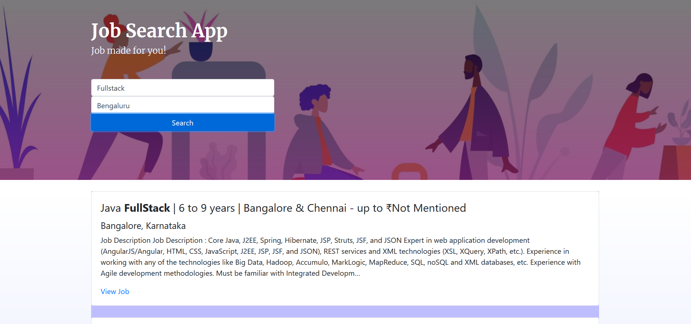

# Job Search Application

The project uses the API of adzuna to show the jobs available for a particular position in any city/country.

The project is built using HTML, CSS(SCSS), JS and NodeJS.

To run the project:

- Download the repository.
- Make sure you have nodeJS and npm installed on your system.
- Install all dependencies.
- Make an account on [Adzuna](https://developer.adzuna.com/) and create a file in api folder called 'keys.js'. In the keys.js:
  `module.exports = { APP_ID: "YOUR_APP_ID", API_KEY: "YOUR_API_KEY", };`
- Execute the following commands:
  `node api/index.js` and keep this terminal running.
- Open up a new terminal and execute:
  `cd frontend` and then `npm start`.
- Navigate to 'localhost:1234' on your browser.
